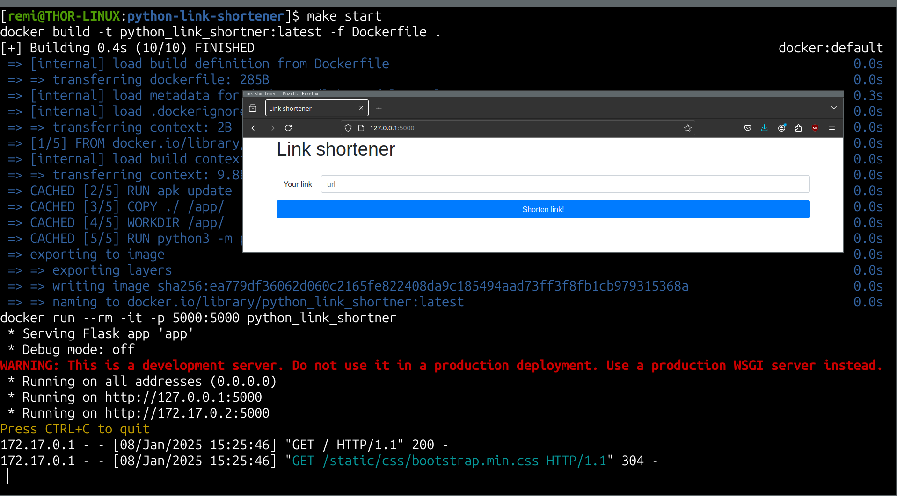

# python-link-shortener

Simple python link shortener in Flask.

## Features

 - [x] Shorten links and redirections
 - [ ] Upload files
 - [ ] Set maximum retention time
 - [ ] Set an access password to links

## Usage

In order to start the container of the server, just type in this repository:

```
make start
```

This will start a Docker container listenning ontcp port 5000 with the link shortener server.

## Demonstration



## Contributing

Pull requests are welcome. Feel free to open an issue if you want to add other features.
